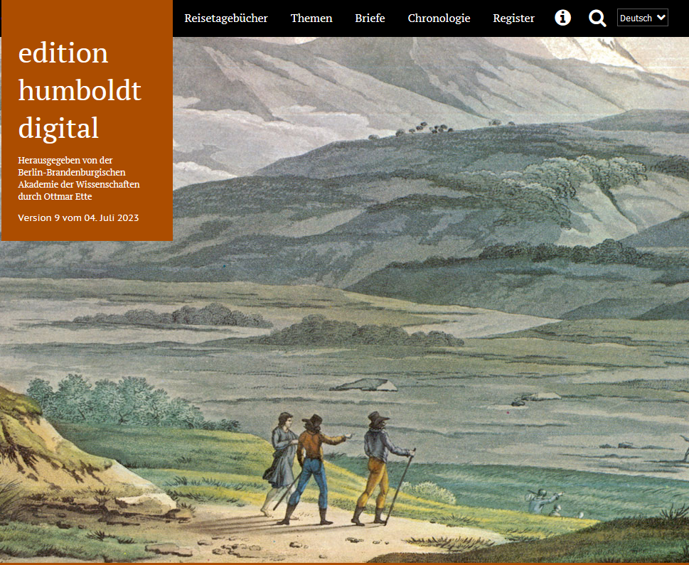

# Adventskalender Test

<link rel="stylesheet" href="style.css">

<!-- Advent Calendar HTML Start: ordered list with all the Adventskalender content.
Already in the order to be shown  -->

  <ol id="advent-calendar">
    <li id="day3">
      <a href="#day3">
        <h2>Day 3</h2>
      </a>
      

        Another text example with a <a href="http://example.com">link</a>
      

      
Day 3 Title

    </li>  
    <li id="day1">
      <a href="#day1">
        <h2>Day 1</h2>
      </a>
      
      

        Die <a href="https://edition-humboldt.de/index.xql?l=de">edition humboldt digital</a>
        besticht nicht nur durch ihr Aussehen, sondern auch durch ihre gelungene
        <a href="https://edition-humboldt.de/about/index.xql?id=H0016212&l=de">Dokumentation</a>.
         #textplus_advent #modeledition #digitalhumanities
      

      
Edition Humboldt Digital

    </li>
    <li id="day5" >
      <a href="#day5">
        <h2>Day 5</h2>
      </a>
      
Content for Day 5

      
Pessoa Digital

    </li>
    <li id="day12">
      <a href="#day12">
        <h2>Day 12</h2>
      </a>
      
Content for Day 12

      
Day 12 Title

    </li>
    <li id="day24">
      <a href="#day24">
        <h2>Day 24</h2>
      </a>
      
Content for Day 24

      
Day 24 Title

    </li>
    <li id="day7">
      <a href="#day7">
        <h2>Day 7</h2>
      </a>
      
Content for Day 7

      
Day 7 Title

    </li>
    <li id="day16">
      <a href="#day16">
        <h2>Day 16</h2>
      </a>
      
Content for Day 16

      
Day 16 Title

    </li>
    <li id="day9">
      <a href="#day9">
        <h2>Day 9</h2>
      </a>
      
Content for Day 9

      
Day 9 Title

    </li>
    <li id="day22">
      <a href="#day22">
        <h2>Day 22</h2>
      </a>
      
Content for Day 22

      
Day 22 Title

    </li>
    <li id="day4">
      <a href="#day4">
        <h2>Day 4</h2>
      </a>
      
Content for Day 4

      
Day 4 Title

    </li>
    <li id="day10">
      <a href="#day10">
        <h2>Day 10</h2>
      </a>
      
Content for Day 10

      
Day 10 Title

    </li>
    <li id="day19">
      <a href="#day19">
        <h2>Day 19</h2>
      </a>
      
Content for Day 19

      
Day 19 Title

    </li>
    <li id="day2">
      <a href="#day2">
        <h2>Day 2</h2>
      </a>
      
Some text with a <a href="http://example.com">link</a>

      
Day 2 Title

    </li>
    <li id="day13">
      <a href="#day13">
        <h2>Day 13</h2>
      </a>
      
Content for Day 13

      
Day 13 Title

    </li>
    <li id="day21">
      <a href="#day21">
        <h2>Day 21</h2>
      </a>
      
Content for Day 21

      
Day 21 Title

    </li>
    <li id="day8">
      <a href="#day8">
        <h2>Day 8</h2>
      </a>
      
Content for Day 8

      
Day 8 Title

    </li>
    <li id="day14">
      <a href="#day14">
        <h2>Day 14</h2>
      </a>
      
Content for Day 14

      
Day 14 Title

    </li>
    <li id="day6">
      <a href="#day6">
        <h2>Day 6</h2>
      </a>
      
Content for Day 6

      
Day 6 Title

    </li>
    <li id="day17">
      <a href="#day17">
        <h2>Day 17</h2>
      </a>
      
Content for Day 17

      
Day 17 Title

    </li>
    <li id="day20">
      <a href="#day20">
        <h2>Day 20</h2>
      </a>
      
Content for Day 20

      
Day 20 Title

    </li>
    <li id="day11">
      <a href="#day11">
        <h2>Day 11</h2>
      </a>
      
Content for Day 11

      
Day 11 Title

    </li>
    <li id="day18">
      <a href="#day18">
        <h2>Day 18</h2>
      </a>
      
Content for Day 18

      
Day 18 Title

    </li>
    <li id="day23">
      <a href="#day23">
        <h2>Day 23</h2>
      </a>
      
Content for Day 23

      
Day 23 Title

    </li>
    <li id="day15">
      <a href="#day15">
        <h2>Day 15</h2>
      </a>
      
Content for Day 15

      
Day 15 Title

    </li>
  </ol>
  <!-- Add overlay element - this will be the "popup" box with the content
  of each door -->
  

    

      <button id="close-button">&times;</button>
      <h2 id="overlay-title"></h2>
      
      

    

  

  <!-- Add button to open all "openable" doors -->
  <button id="open-all-doors">Open All Doors</button>

