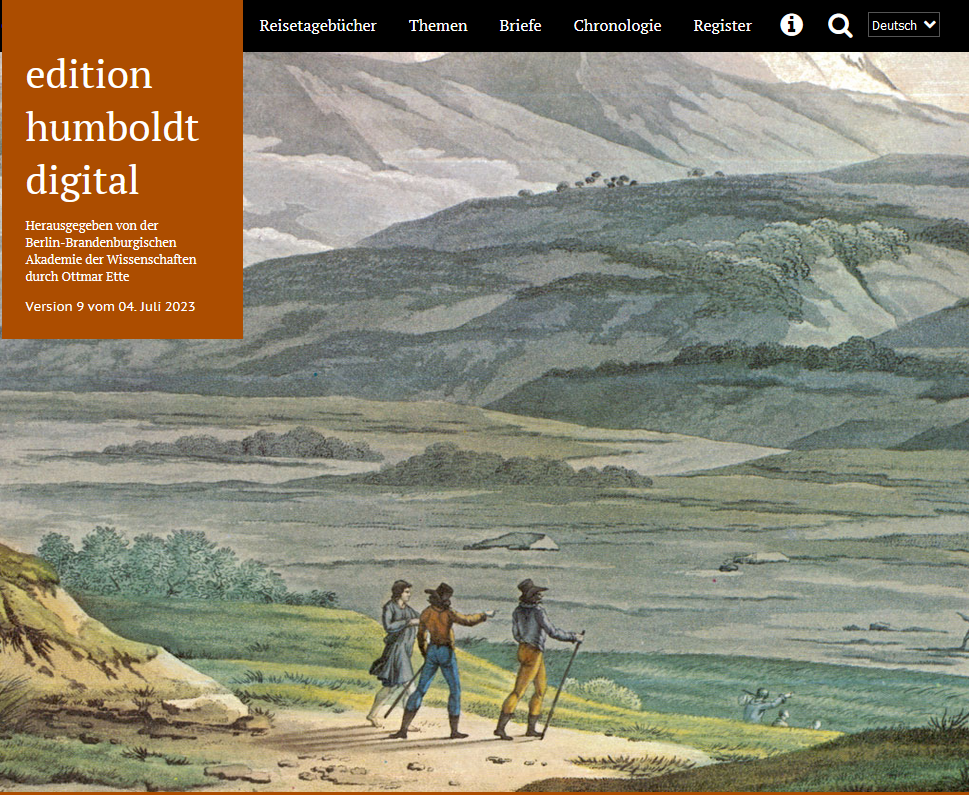

# Welcome to My GitHub Pages

Here is some introductory content for my GitHub Pages site.
<link rel="stylesheet" href="style.css">

<!-- Advent Calendar HTML Start -->

  <ol id="advent-calendar">
    <li id="day3" data-short-title="Day 3 Title">
      <a href="#day3">
        <h2>Day 3</h2>
      </a>
      

        Another text example with a <a href="http://example.com">link</a>
      

    </li>
    <li id="day1" data-short-title="Edition Humboldt Digital">
      <a href="#day1">
        <h2>Day 1</h2>
      </a>
      
      

        Die <a href="https://edition-humboldt.de/index.xql?l=de">edition humboldt digital</a>
        besticht nicht nur durch ihr Aussehen, sondern auch durch ihre gelungene
        <a href="https://edition-humboldt.de/about/index.xql?id=H0016212&l=de">Dokumentation</a>.
         #textplus_advent #modeledition #digitalhumanities
      

    </li>
    <li id="day5" data-short-title="Pessoa Digital"><a href="#day5">
        <h2>Day 5</h2>
      </a>
      
Content for Day 5

    </li>
    <li id="day12" data-short-title="Day 12 Title"><a href="#day12">
        <h2>Day 12</h2>
      </a>
      
Content for Day 12

    </li>
    <li id="day24" data-short-title="Day 24 Title"><a href="#day24">
        <h2>Day 24</h2>
      </a>
      
Content for Day 24

    </li>
    <li id="day7" data-short-title="Day 7 Title"><a href="#day7">
        <h2>Day 7</h2>
      </a>
      
Content for Day 7

    </li>
    <li id="day16" data-short-title="Day 16 Title"><a href="#day16">
        <h2>Day 16</h2>
      </a>
      
Content for Day 16

    </li>
    <li id="day9" data-short-title="Day 9 Title"><a href="#day9">
        <h2>Day 9</h2>
      </a>
      
Content for Day 9

    </li>
    <li id="day22" data-short-title="Day 22 Title"><a href="#day22">
        <h2>Day 22</h2>
      </a>
      
Content for Day 22

    </li>
    <li id="day4" data-short-title="Day 4 Title"><a href="#day4">
        <h2>Day 4</h2>
      </a>
      
Content for Day 4

    </li>
    <li id="day10" data-short-title="Day 10 Title"><a href="#day10">
        <h2>Day 10</h2>
      </a>
      
Content for Day 10

    </li>
    <li id="day19" data-short-title="Day 19 Title"><a href="#day19">
        <h2>Day 19</h2>
      </a>
      
Content for Day 19

    </li>
    <li id="day2" data-short-title="Day 2 Title"><a href="#day2">
        <h2>Day 2</h2>
      </a>
      
Some text with a <a href="http://example.com">link</a>

    </li>
    <li id="day13" data-short-title="Day 13 Title"><a href="#day13">
        <h2>Day 13</h2>
      </a>
      
Content for Day 13

    </li>
    <li id="day21" data-short-title="Day 21 Title"><a href="#day21">
        <h2>Day 21</h2>
      </a>
      
Content for Day 21

    </li>
    <li id="day8" data-short-title="Day 8 Title"><a href="#day8">
        <h2>Day 8</h2>
      </a>
      
Content for Day 8

    </li>
    <li id="day14" data-short-title="Day 14 Title"><a href="#day14">
        <h2>Day 14</h2>
      </a>
      
Content for Day 14

    </li>
    <li id="day6" data-short-title="Day 6 Title"><a href="#day6">
        <h2>Day 6</h2>
      </a>
      
Content for Day 6

    </li>
    <li id="day17" data-short-title="Day 17 Title"><a href="#day17">
        <h2>Day 17</h2>
      </a>
      
Content for Day 17

    </li>
    <li id="day20" data-short-title="Day 20 Title"><a href="#day20">
        <h2>Day 20</h2>
      </a>
      
Content for Day 20

    </li>
    <li id="day11" data-short-title="Day 11 Title"><a href="#day11">
        <h2>Day 11</h2>
      </a>
      
Content for Day 11

    </li>
    <li id="day18" data-short-title="Day 18 Title"><a href="#day18">
        <h2>Day 18</h2>
      </a>
      
Content for Day 18

    </li>
    <li id="day23" data-short-title="Day 23 Title"><a href="#day23">
        <h2>Day 23</h2>
      </a>
      
Content for Day 23

    </li>
    <li id="day15" data-short-title="Day 15 Title"><a href="#day15">
        <h2>Day 15</h2>
      </a>
      
Content for Day 15

    </li>
  </ol>
  

    

      <button id="close-button">&times;</button>
      <h2 id="overlay-title"></h2>
      
      

    

  

  <button id="open-all-doors">Open All Doors</button>

<!-- Advent Calendar HTML End -->

This is some additional content on my GitHub Pages site.

